# 🤖 Custom AI Chatbot

> Intelligent document processing chatbot with AI-powered Q&A capabilities, built with Firebase Functions backend and React Native frontend

## 🎯 Overview

A full-stack AI chatbot application developed as a client project for an organization that needed an intelligent document processing system for their volunteers and staff. The system enables admin users to upload organizational documents (policies, guides, event information, training materials) and allows all users to ask questions through a natural language interface, making information more accessible to team members.

This project demonstrates real-world software development including client communication, requirements gathering, full-stack development, and deployment. Built with modern technologies including Firebase Functions, React Native, Firebase, and Google's Gemini AI, it showcases enterprise-level software architecture with real-time chat capabilities, document management, and scalable cloud deployment.

## ✨ Key Features

- 🤖 **AI-Powered Q&A** - Advanced document analysis using Google Gemini AI for organizational knowledge
- 📄 **Multi-Format Support** - Handle PDF, DOCX, and TXT documents (policies, guides, training materials)
- 💬 **Volunteer-Friendly Interface** - Simple, intuitive chat interface for quick information access
- 📱 **Cross-Platform Access** - React Native mobile app with web compatibility for field use
- ☁️ **Cloud Integration** - Firebase backend with secure file storage and real-time sync
- 🔍 **Intelligent Search** - Smart document chunking and semantic search across organizational content
- 🛡️ **Secure Processing** - Enterprise-grade security for sensitive organizational documents
- 📊 **Usage Analytics** - Conversation logs and insights for organizational knowledge gaps
- 🎯 **Context-Aware Responses** - AI understands organizational context and terminology

## 🛠️ Tech Stack

### Backend
- **Python 3.12** - Core backend language
- **Firebase Functions** - Serverless cloud functions for API endpoints
- **Google Gemini AI** - Large language model integration
- **Firebase Admin SDK** - Backend cloud services integration
- **PyPDF2/python-docx** - Document processing libraries

### Frontend
- **React Native** - Cross-platform mobile development
- **TypeScript** - Type-safe JavaScript development
- **Expo** - React Native development platform
- **Firebase SDK** - Frontend cloud services integration

### Infrastructure
- **Firebase Cloud Functions** - Serverless backend processing
- **Firebase Firestore** - NoSQL document database
- **Firebase Storage** - File upload and management
- **Firebase Hosting** - Web app deployment

## 📱 Application Screenshots

### 🔐 User Authentication
<table>
<tr>
<td align="center"><b>Web Platform</b></td>
<td align="center"><b>Mobile Platform</b></td>
</tr>
<tr>
<td>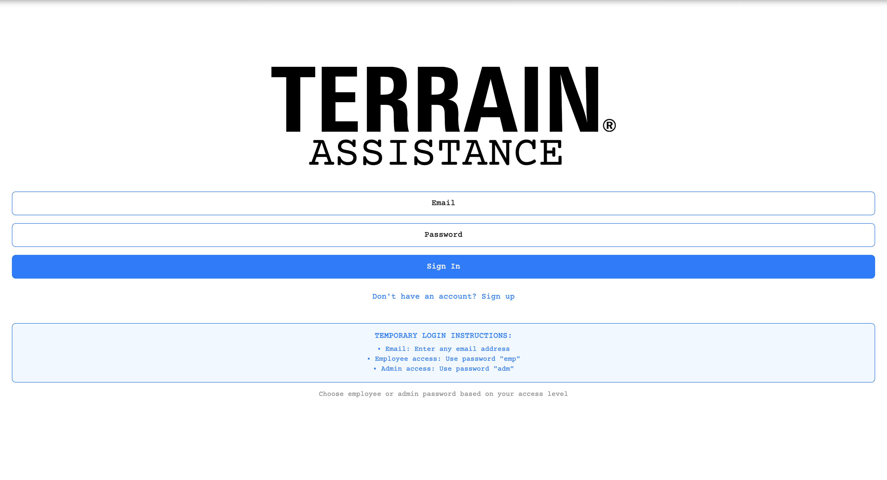</td>
<td>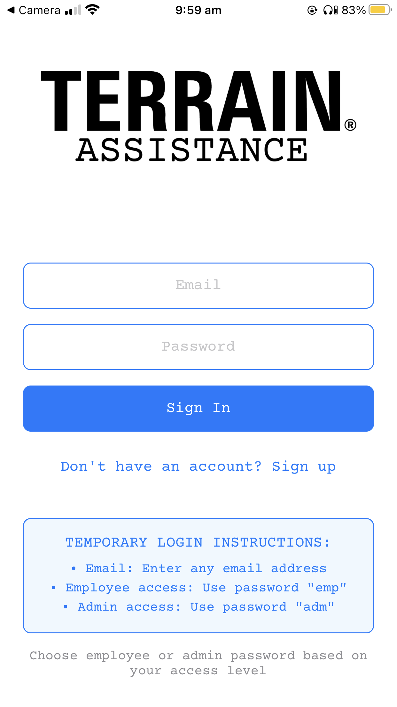</td>
</tr>
</table>

### 💬 Chat Interface  
<table>
<tr>
<td align="center"><b>Web Platform</b></td>
<td align="center"><b>Mobile Platform</b></td>
</tr>
<tr>
<td>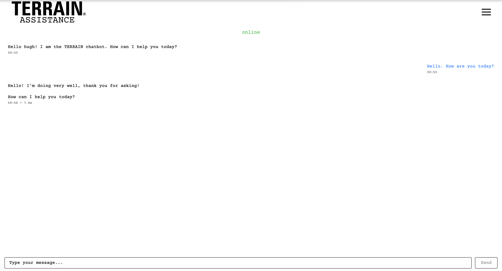</td>
<td>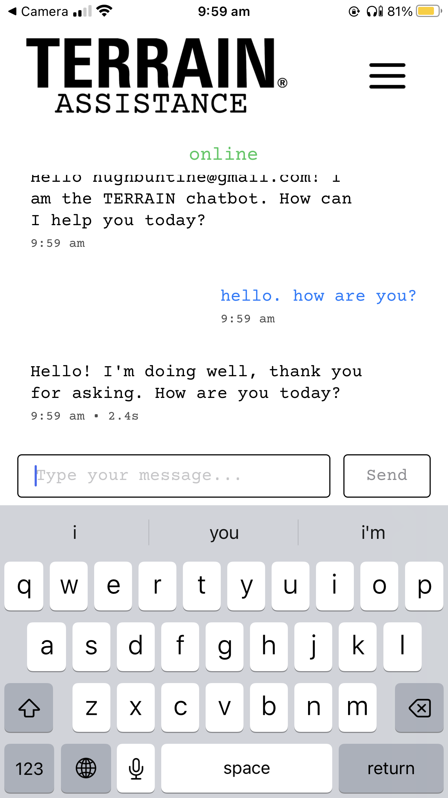</td>
</tr>
</table>

### 📋 Navigation Menu
<table>
<tr>
<td align="center"><b>Web Platform</b></td>
<td align="center"><b>Mobile Platform</b></td>
</tr>
<tr>
<td>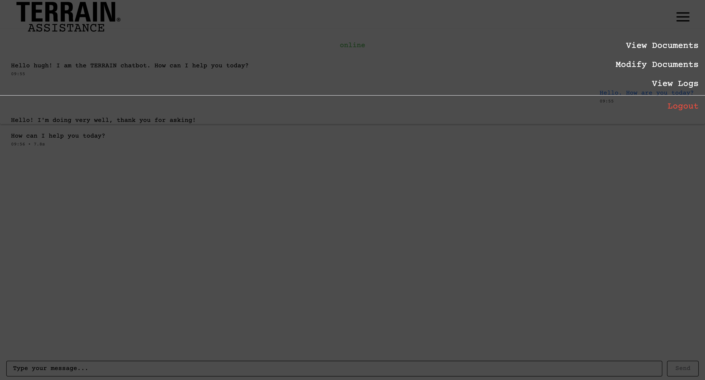</td>
<td>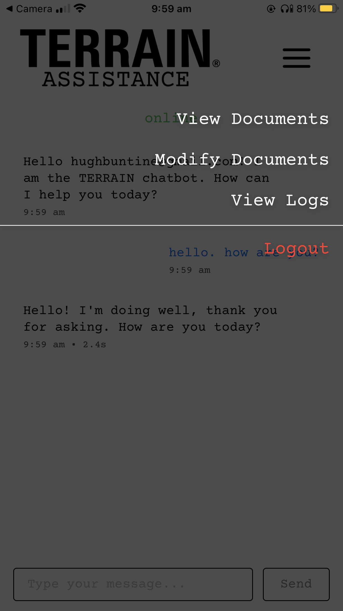</td>
</tr>
</table>

### 📚 Document Viewing
<table>
<tr>
<td align="center"><b>Web Platform</b></td>
<td align="center"><b>Mobile Platform</b></td>
</tr>
<tr>
<td>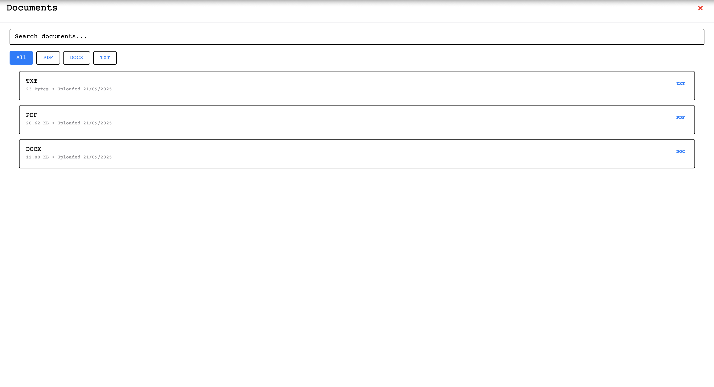</td>
<td>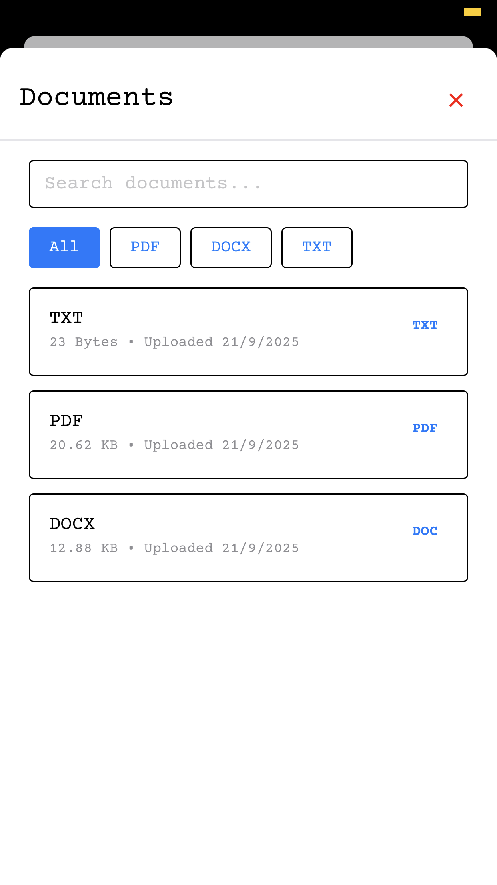</td>
</tr>
</table>

### 📄 PDF Document Reader
<table>
<tr>
<td align="center"><b>Web Platform</b></td>
<td align="center"><b>Mobile Platform</b></td>
</tr>
<tr>
<td>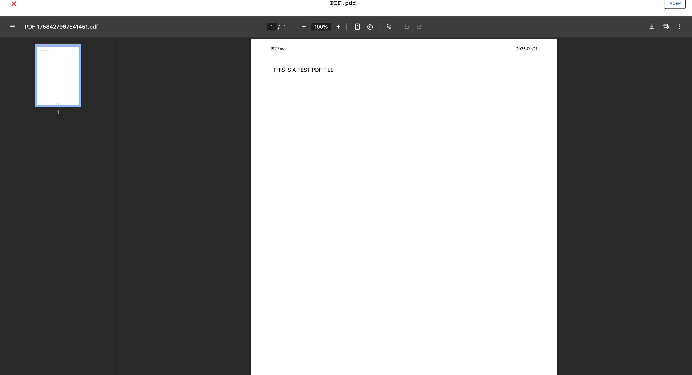</td>
<td></td>
</tr>
</table>

### 📝 Document Management (Admin)
<table>
<tr>
<td align="center"><b>Web Platform</b></td>
<td align="center"><b>Mobile Platform</b></td>
</tr>
<tr>
<td>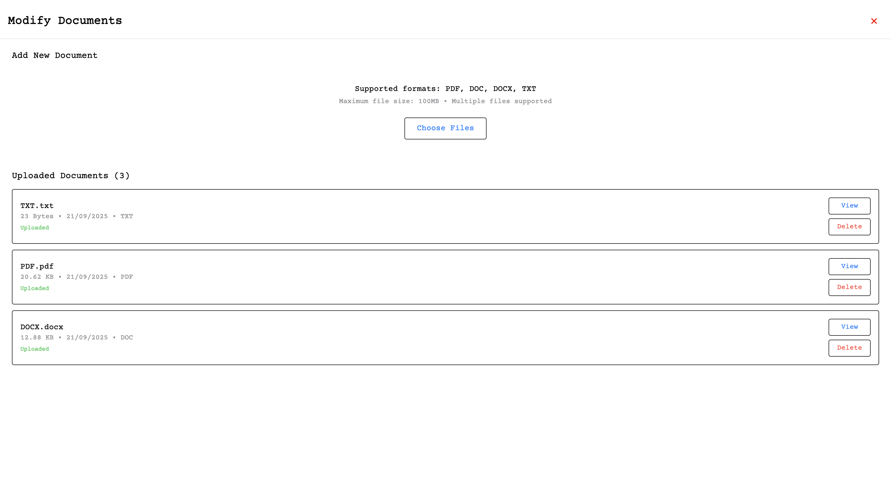</td>
<td>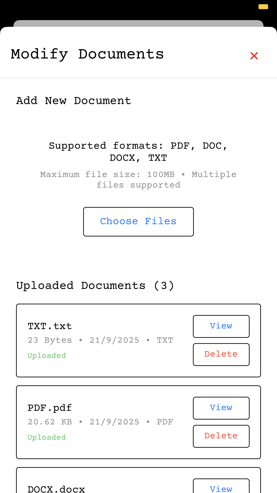</td>
</tr>
</table>

### 💭 Conversation History
<table>
<tr>
<td align="center"><b>Web Platform</b></td>
<td align="center"><b>Mobile Platform</b></td>
</tr>
<tr>
<td>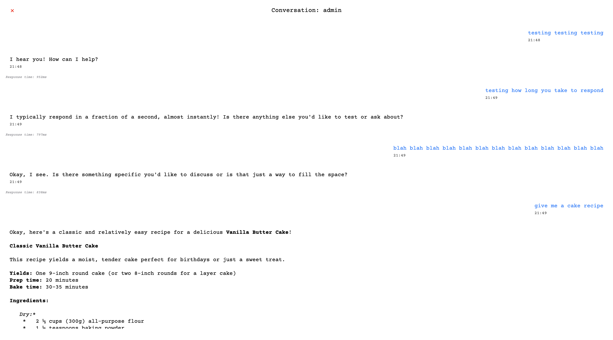</td>
<td>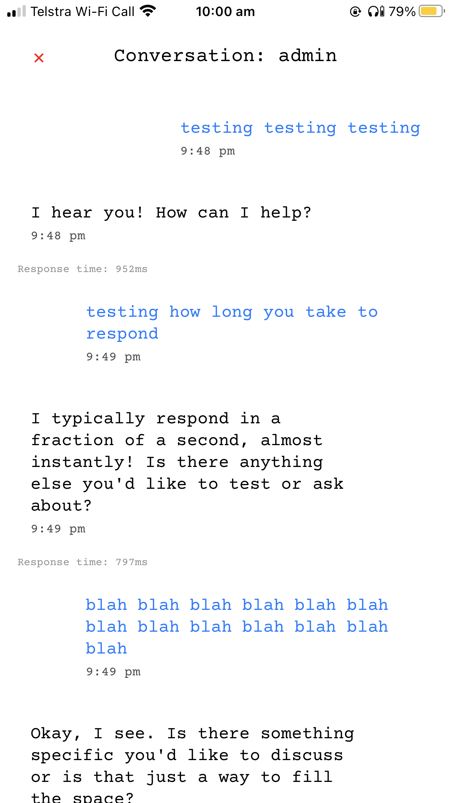</td>
</tr>
</table>

### 📊 Chat Analytics (Admin)
<table>
<tr>
<td align="center"><b>Web Platform</b></td>
<td align="center"><b>Mobile Platform</b></td>
</tr>
<tr>
<td>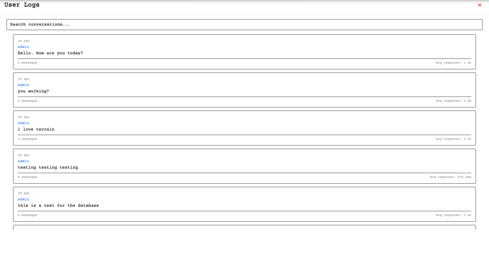</td>
<td>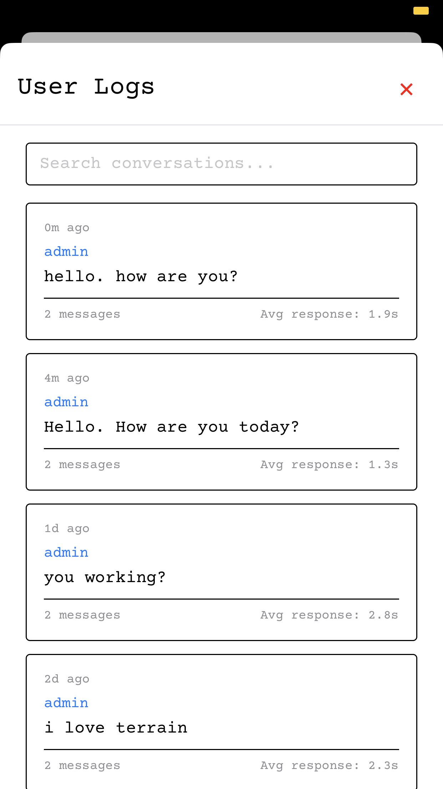</td>
</tr>
</table>

## 🏗️ Architecture

  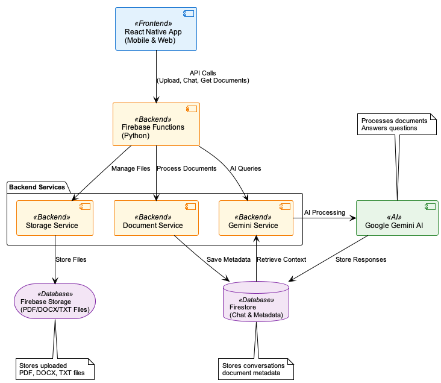

### Key Components
- **Document Processor** - Extracts and chunks text from various file formats
- **AI Service Integration** - Manages Gemini AI API calls and response processing
- **Retrieval System** - Semantic search and context retrieval for Q&A
- **Chat Interface** - Real-time messaging with conversation persistence
- **Storage Service** - Secure file upload and management via Firebase Storage
- **Serverless Functions** - Auto-scaling Firebase Functions for API endpoints

## 🔧 Key Technologies

**Backend Configuration:**
- Google Gemini AI API integration
- Firebase Admin SDK for cloud services
- Environment-based configuration management

**Frontend Configuration:**
- Firebase SDK for real-time data sync
- Expo configuration for cross-platform deployment
- TypeScript for development tooling

### Production Deployment
- **Backend**: Firebase Functions (serverless, auto-scaling)
- **Frontend**: Build and deploy to Firebase Hosting or app stores
- **Database**: Configure Firestore security rules for production

## 🤝 Contributing

This project was developed as a client solution and serves as a portfolio demonstration. The architecture and implementation showcase:
- **Full-stack development** capabilities across mobile and serverless platforms
- **Client communication** and requirements gathering experience
- **AI integration** with modern LLM services
- **Real-world deployment** and production considerations

Feedback and suggestions for improvements are welcome!

## 👨‍💻 About the Developer

**Hugh Buntine** - Full-Stack Developer & AI Enthusiast

This project demonstrates:
- **Full-stack development** - Complete ownership of both frontend (React Native) and backend (Firebase Functions)
- **Client project management** - Lead communication with stakeholders and requirements gathering
- **AI/ML integration** - Implementing modern LLM services for real-world applications
- **Production deployment** - End-to-end delivery of scalable cloud solutions

- 💼 LinkedIn: [[hugh-buntine](https://www.linkedin.com/in/hugh-buntine/)]
- 📧 Email: [hughbuntine@gmail.com]
- 🐙 GitHub: [hugh-buntine](https://github.com/hugh-buntine)

